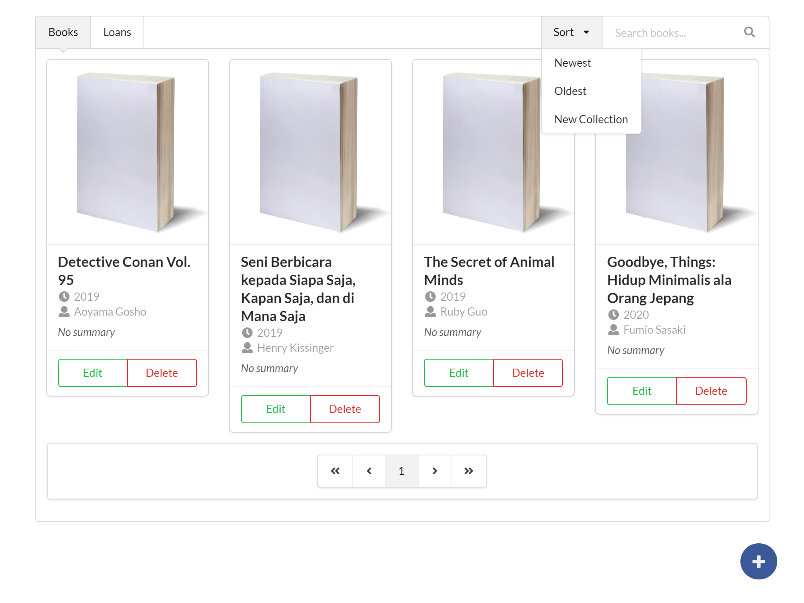
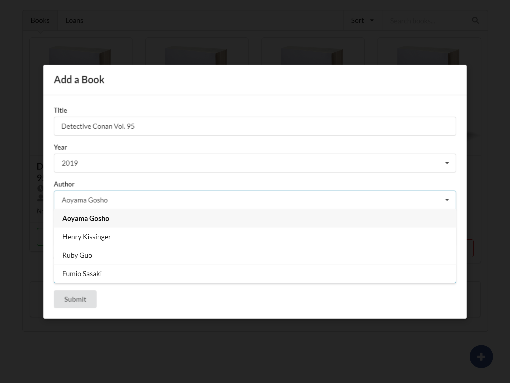

# README

Library-WEB adalah sebuah aplikasi front-end yang dibangun dengan framework React. Aplikasi ini dikembangkan untuk membantu manajemen perpustakaan.

## Previews






## Cara Pemakaian
Sebelum menggunakan, clone source code ke folder, lalu dilanjutkan dengan menginstall dependensi package yang diperlukan.
```sh
$ git clone https://github.com/irvanherz/library-web.git
$ cd library-web
$ yarn install
```
Aplikasi ini membutuhkan [Library API](https://github.com/irvanherz/library) server untuk dapat berjalan. Sebelumnya, pastikan API server sudah berjalan dan dikonfigurasikan pada file `.env`.  Ubah variabel `REACT_APP_API_HOST` agar sesuai dengan konfigurasi Library API Server.

```
REACT_APP_API_HOST=http://127.0.0.1:3001
```

Setelah konfigurasi selesai, Anda bisa menggunakan *yarn* dan memilih apakah Anda ingin menjalankan atau men-deploy aplikasi..
```
$ yarn start
```
atau...
```
$ yarn build
```
